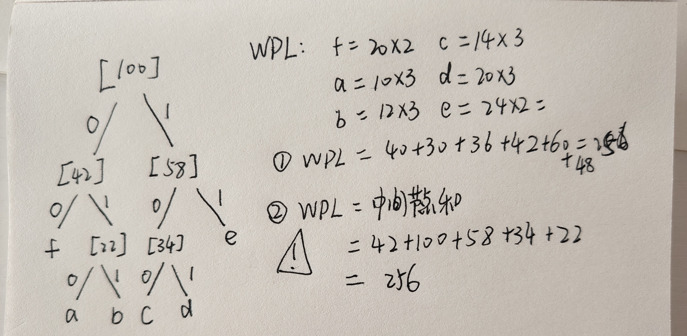

# 哈夫曼树 

哈夫曼树的构建 

1. [.h](../HuffmanNode.h)
2. [.cpp](../huffman.cpp)
--- 

1. 带权路径长度
2. 叶子节点及其权值（WPL）
3. 目标：使WPL最小

# 哈夫曼编码

在哈夫曼树的基础上，左边为0 右边是1。

注意：**哈夫曼编码是在边上写数值**而不是节点上。

任何一个字符的编码不是另一个字符编码的前缀（前缀码性质），保证解码唯一。

# WPL

带权路径和

**带权路径长度 = 叶子节点的权重 * 根节点到叶子的长度（边数，几条边）**

Σ每一个节点的WPL

另一种算法：

哈夫曼树的 WPL，直接等于**所有中间分支节点（非叶子节点）的权值之和**

# 例题

a: 10, b: 12, c: 14, d: 20, f: 20, e: 24

求对应的哈夫曼树和哈夫曼编码以及WPL

