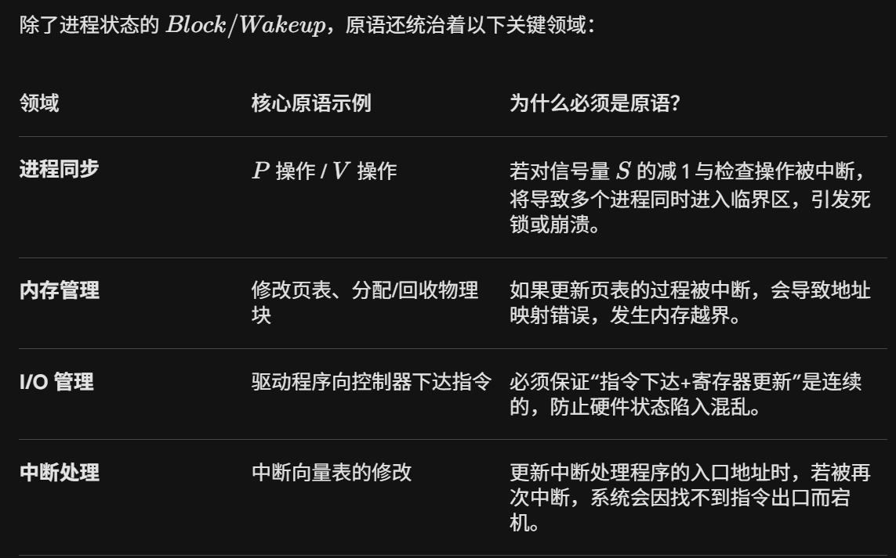

原语不只局限于进程状态管理，它是操作系统内核中一切“必须原子执行”逻辑的通用底层实现工具。



在x86中CLI(Clear Interrupt)和STI(Set Interrupt)：开中断，关中断，直接操作CPU标志寄存器中的IF标志位，允许中断位。

撤销原语：

```c
void terminate_process_primitive(int pid) {
    disable_interrupts(); // cli

    PCB *target = find_pcb(pid);

    if(target == NULL) {
        enable_interrupts() // 开中断
        return;
    }

    // 清理子进程
    kill_child_processes(target);

    // 释放资源
    release_system_resources(target);

    target->state = TASK_ZOMBIE;

    move_to_cleanup_queue(target);

    enable_interrupts(); // sti
} 
```


